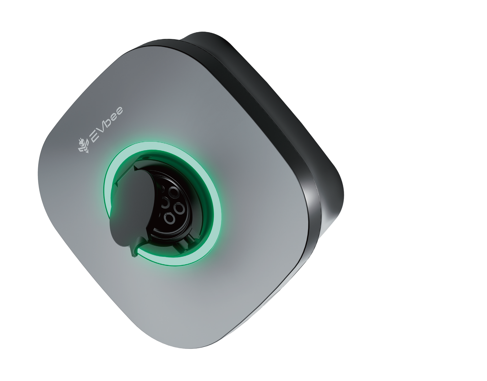

# Ice Age Technology Ltd Website

Static website for Ice Age Technology Ltd, an Ireland-focused EV charging distribution business supplying AC home chargers, DC fast chargers, and energy-storage backed charging solutions.

The site is built as a single HTML page and deployed with GitHub Pages.

## Project Structure

```text
.
├── index.html                 # Main website page, styles, and content
├── images/                    # Product images used by the page
│   ├── dc-explode.png
│   ├── dc-front.png
│   ├── lux-explode.png
│   └── lux-front.png
└── .github/workflows/static.yml # GitHub Pages deployment workflow
```

## Local Preview

No build step or package installation is required.

Open `index.html` directly in a browser, or serve the directory with a simple local web server:

```powershell
python -m http.server 8000
```

Then visit:

```text
http://localhost:8000
```

## Deployment

The site deploys automatically to GitHub Pages when changes are pushed to the `main` branch.

Deployment is handled by:

```text
.github/workflows/static.yml
```

The workflow uploads the full repository as a static Pages artifact and publishes it through GitHub Pages.

## Editing Content

Most website content is in `index.html`, including:

- Navigation labels
- Product descriptions
- Technical specifications
- Partner messaging
- Contact links
- Page styling

Product images are stored in `images/` and referenced with relative paths such as:

```html

```

## Downloads

The downloads section links to downloadable datasheet files under `downloads/`:

```text
downloads/LUX AC Home_Datasheet_20250417-ZX.pdf
downloads/DC 60&80_Datasheet_20250507.pdf
```

## Contact

The site includes email links for installer partnerships, product demos, and commercial project enquiries.
